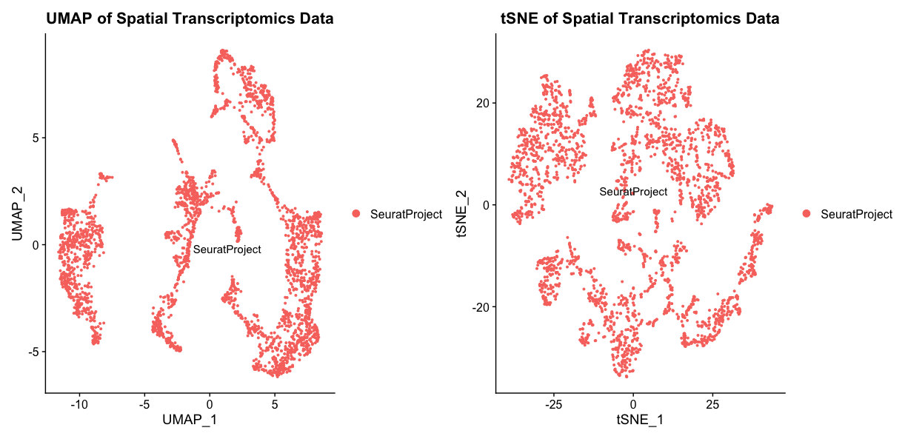
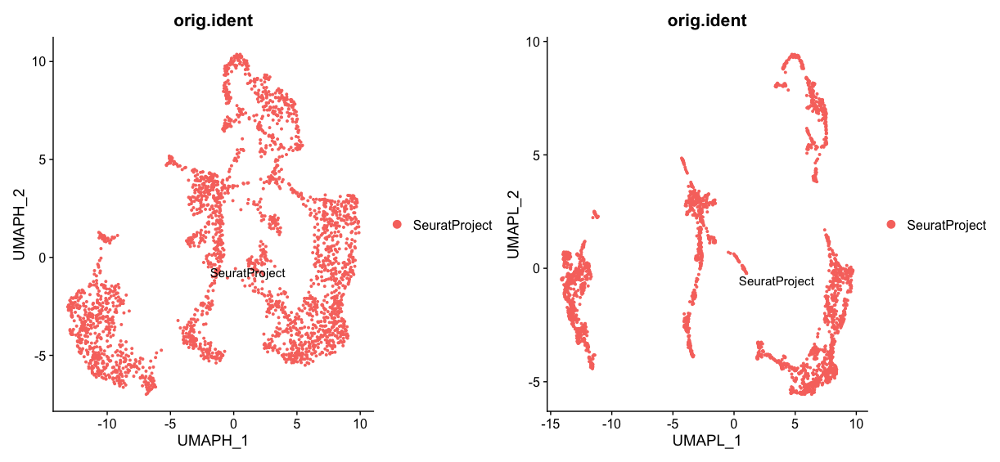
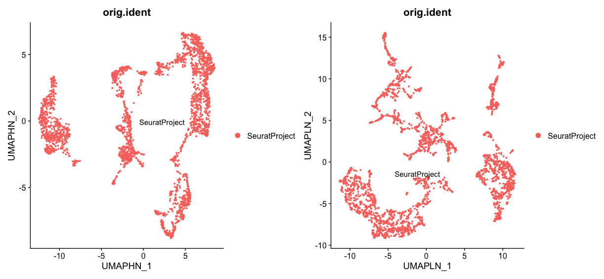
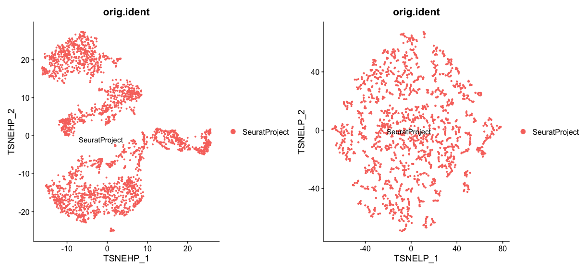

::: {.callout-tip}
#### Learning Objectives

- Perform PCA on spatial transcriptomics data
- Visualize PCA results using UMAP and tSNE
- Learn about important UMAP parameters and how to adjust them
- Learn about tSNE parameters
- Understand the interpretation of PCA, tSNE and UMAP results
:::


## Introduction
We will keep working on the sagittal mouse brain dataset we have been using in previous chapters. If you have not finished the preprocessing, you can load the preprocessed data directly:

```r
# Load the precomputed preprocessed Seurat object
visium <- LoadSeuratRds(visium, file = "precomputed/preprocessed_mouse_sagittal.rds")
``` 

## Principal Component Analysis (PCA)
Principal Component Analysis (PCA) is a dimensionality reduction technique that helps to reduce the complexity of high-dimensional data while retaining most of the variance. In Seurat, you can perform PCA using the `RunPCA` function. This function computes the principal components of the data and stores them in the Seurat object.

```r
#load ggplot2 for visualization
library(ggplot2)

# Perform PCA on the preprocessed data
visium <- RunPCA(visium, assay = "SCT", npcs = 30, verbose = FALSE)
#Check elbow plot to determine the number of significant PCs
ElbowPlot(visium, ndims = 30, reduction = 'pca')
#For good measure, we will check if it is better to use 50 PCs
visium <- RunPCA(visium, assay = "SCT", npcs = 50, verbose = FALSE,  reduction.name = 'pca50')
ElbowPlot(visium, ndims = 50, reduction = 'pca50')
``` 

If we have selected a good number of PCs, we should see a clear elbow in the plot, indicating that the first few PCs capture most of the variance in the data. To be sure we can also check the variance explained by the selected PCs:

```r  
mat <- Seurat::GetAssayData(visium, assay = "SCT", slot = "scale.data")
pca <- visium[["pca"]]

# Get the total variance:
total_variance <- sum(matrixStats::rowVars(mat))

eigValues = (pca@stdev)^2  ## EigenValues
varExplained = eigValues / total_variance
plot(varExplained, xlab = "PCs", ylab = "Variance Explained", main = "Variance Explained by PCs")
``` 

## Uniform Manifold Approximation and Projection (UMAP)
UMAP is another dimensionality reduction technique that is particularly well-suited for visualizing high-dimensional data in a low-dimensional space. In Seurat, you can perform UMAP using the `RunUMAP` function. This function computes the UMAP embedding of the data and stores it in the Seurat object. 

```r
# Perform UMAP on the PCA results
visium <- RunUMAP(visium, reduction = "pca", dims = 1:30)
#Visualize the UMAP results
umap <- DimPlot(visium, reduction = "umap", label = TRUE) + ggtitle("UMAP of Spatial Transcriptomics Data")
```

## tSNE
tSNE is another popular dimensionality reduction technique that is often used for visualizing high-dimensional data. In Seurat, you can perform tSNE using the `RunTSNE` function. This function computes the tSNE embedding of the data and stores it in the Seurat object. It's commonly accepted that UMAP performs better than tSNE, but it can still be useful to compare the results of both methods.

```r
# Perform tSNE on the PCA results
visium <- RunTSNE(visium, reduction = "pca", dims = 1:30)
#Visualize the tSNE results
tsne <- DimPlot(visium, reduction = "tsne", label = TRUE) + ggtitle("tSNE of Spatial Transcriptomics Data")

umap + tsne
``` 

::: {.callout-tip collapse="true"}
#### Result
These plots show the UMAP and tSNE embeddings of the spatial transcriptomics data, with each point representing a spot in the tissue. They are not particularly informative in this case, as we have not performed any clustering or identified any cell types yet. However, they can be useful for visualizing the overall structure of the data and identifying potential clusters or patterns.
{fig-align="center"}

In the UMAP, the overall layout shows how global relationships are maintained better, showing how different clusters relate to each other in a more continuous manner. The tSNE plot, on the other hand, tends to emphasize local relationships, often resulting in more distinct and separated clusters. This can sometimes lead to misinterpretation of the data structure, as tSNE may suggest that clusters are more isolated than they actually are. On the other hand, tSNE preserves local neighborhood structures more effectively, making it easier to identify small clusters or subpopulations within the data. Depending on the specific analysis goals, one method may be preferred over the other.
:::

## Adapting UMAP Parameters
UMAP has several parameters that can be adjusted to change the appearance of the resulting plot. Two important parameters are `n.neighbors` and `min.dist`. The `n.neighbors` parameter controls the size of the local neighborhood used for manifold approximation, while the `min.dist` parameter controls the minimum distance between points in the low-dimensional space. Adjusting these parameters can help to reveal different structures in the data.

```r
# Perform UMAP with different values for min.dist
visium_highmin <- RunUMAP(visium, reduction = "pca", dims = 1:30, n.neighbors = 30, min.dist = 0.5, reduction.name = "umap_highmin", reduction.key = "UMAPH")
visium_lowmin <- RunUMAP(visium, reduction = "pca", dims = 1:30, n.neighbors = 30, min.dist = 0.1, reduction.name = "umap_lowmin", reduction.key = "UMAPL")  

#Visualize the UMAP results with different parameters
hmp <- DimPlot(visium_highmin, reduction = "umap_highmin", label = TRUE)
lmp <- DimPlot(visium_lowmin, reduction = "umap_lowmin", label = TRUE)

hmp + lmp

# Perform UMAP with different values for n.neighbors
visium_highnn <- RunUMAP(visium, reduction = "pca", dims = 1:30, n.neighbors = 100, min.dist = 0.3, reduction.name = "umap_highnn", reduction.key = "UMAPHN")
visium_lownn <- RunUMAP(visium, reduction = "pca", dims = 1:30, n.neighbors = 5, min.dist = 0.3, reduction.name = "umap_lownn", reduction.key = "UMAPLN")


#Visualize the UMAP results with different parameters
hnn <- DimPlot(visium_highnn, reduction = "umap_highnn", label = TRUE)
lnn <- DimPlot(visium_lownn, reduction = "umap_lownn", label = TRUE)

hnn + lnn
```

::: {.callout-tip collapse="true"}
#### Result
First let's look at the effect of changing the `min.dist` parameter. A higher `min.dist` value (0.5) results in a more spread-out UMAP plot, where clusters are more separated from each other. This can help to highlight global structures in the data. On the other hand, a lower `min.dist` value (0.1) results in a more compact UMAP plot, where clusters are closer together. This can help to reveal local structures in the data.
{fig-align="center"}

Next, let's look at the effect of changing the `n.neighbors` parameter. A higher `n.neighbors` value (100) results in a UMAP plot that captures more global structures, with clusters being more connected and spread out. This can help to reveal broader patterns in the data. On the other hand, a lower `n.neighbors` value (5) results in a UMAP plot that captures more local structures, with clusters being more distinct and separated. This can help to identify smaller subpopulations within the data.
{fig-align="center"}
:::

## Adapting tSNE Parameters
tSNE also has  parameters that can be adjusted to change the appearance of the resulting plot. The most important parameter is `perplexity`. The `perplexity` parameter controls the balance between local and global aspects of the data. Adjusting this parameter can help to reveal different structures in the data.  

```r
# Perform tSNE with different values for perplexity
visium_highperp <- RunTSNE(visium, reduction = "pca", dims = 1:30, perplexity = 100, reduction.name = "tsne_highperp", reduction.key = "TSNEHP")
visium_lowperp <- RunTSNE(visium, reduction = "pca", dims = 1:30, perplexity = 5, reduction.name = "tsne_lowperp", reduction.key = "TSNELP")

#Visualize the tSNE results with different parameters
htp <- DimPlot(visium_highperp, reduction = "tsne_highperp", label = TRUE)
ltp <- DimPlot(visium_lowperp, reduction = "tsne_lowperp", label = TRUE)

htp + ltp
``` 

::: {.callout-tip collapse="true"}
#### Result
Let's look at the effect of changing the `perplexity` parameter. A higher `perplexity` value (100) results in a tSNE plot that captures more global structures, with clusters being more connected and spread out. This can help to reveal broader patterns in the data. On the other hand, a lower `perplexity` value (5) results in a tSNE plot that captures more local structures, with small clusters being more distinct and separated. This can help to identify smaller subpopulations within the data.

{fig-align="center"}
:::

Just like in the last chapter we are going to clean up the environment by removing the created Seurat objects with different UMAP and tSNE parameters. For a propper cleanup we will not only remove the objects but also run garbage collection to free up memory.

```r
rm(visium_highmin, visium_lowmin, visium_highnn, visium_lownn, visium_highperp, visium_lowperp)
gc()
``` 

## Conclusion
In this chapter, we have learned how to perform PCA and UMAP on spatial transcriptomics data using Seurat. We have also visualized the results using UMAP and tSNE plots. Dimensionality reduction techniques like PCA and UMAP are essential for analyzing high-dimensional data, as they help to reduce complexity while retaining important information. 
It's important to note that the choice of parameters in UMAP and tSNE can significantly affect the resulting plots. By adjusting these parameters, we can reveal different structures in the data, allowing for better visualization and interpretation.
You can use these techniques to explore and visualize your spatial transcriptomics data, identify patterns, and gain insights into the underlying biology.

## Summary
::: {.callout-tip}
#### Key Points
- PCA is a dimensionality reduction technique that helps to reduce the complexity of high-dimensional data while retaining most of the variance.
- UMAP is another dimensionality reduction technique that is particularly well-suited for visualizing high-dimensional data in a low-dimensional space.
- Seurat provides functions for performing PCA, UMAP and tSNA on spatial transcriptomics data.
- Dimensionality reduction techniques like PCA and UMAP are essential for analyzing high-dimensional data, as they help to reduce complexity while retaining important information.
- Adjusting parameters in UMAP and tSNE can help to reveal different structures in the data, allowing for better visualization and interpretation.
:::