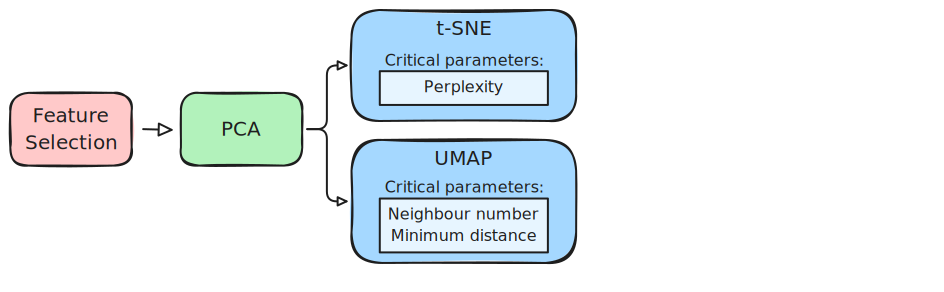

# Dimensionality Reduction

```{r}
#| label: setup
#| include: false

knitr::opts_chunk$set(echo = TRUE, message = FALSE, warning = FALSE)

# set the working directory to the course_files folder
# make sure to run course_files/download_course_files.sh
knitr::opts_knit$set(root.dir = here::here("course_files"))
```

::: {.callout-tip}
#### Learning Objectives

- Perform PCA on spatial transcriptomics data
- Visualize PCA results using UMAP and tSNE
- Learn about important UMAP parameters and how to adjust them
- Learn about tSNE parameters
- Understand the interpretation of PCA, tSNE and UMAP results
:::

## Setup

We will keep working on the sagittal mouse brain dataset we have been using in previous chapters.

Start by loading the required libraries and reading the Seurat object from the previous chapter.

```{r}
#| label: load-visium-data

# Load libraries
library(Seurat) # single-cell and spatial analysis toolkit
library(sparseMatrixStats)
library(paletteer) # colour palettes
library(ggplot2) # plotting
library(patchwork) # combining plots

# Load the Seurat object from the previous chapter
visium <- readRDS("precomputed/mouse_brain_normalised.rds")
```

As a reminder, this object was created by:

- Importing the raw data using `Load10X_Spatial()`, followed by QC and filtering to remove low-quality spots.
- Normalising the data using three different methods:
  - `NormalizeData()` with log-normalisation and `ScaleData()` for Z-scoring and regressing out confounders.
    Stored in the "Spatial" assay.
  - Scran normalisation using `scran::quickCluster()` and `scuttle::pooledSizeFactors()`.
    Stored in the "Scran" assay.
  - `SCTransform()` normalisation, which models technical variation and applies variance stabilisation.
    Stored in the "SCT" assay.

## Dimensionality Reduction

Dimensionality reduction is a common step in the analysis of high-dimensional data, such as spatial (and single-cell) transcriptomics data.
Its main goal is to reduce our matrix of gene expression from thousands of genes to a smaller number of dimensions that still capture most of the variation in the data.
One way to think about these methods, is that they are trying to capture correlated signal across genes, and therefore transform the data such that it can be represented in a few new axes of dimensions.

Broadly speaking, there are two main types of algorithms:

- **Linear algorithms**: Apply a transformation that retains the relative distances between the original points in the data (spots/cells in our case).
  - Methods include Principal Components Analysis (PCA) and Non-negative matrix factorization (NMF).

- **Nonlinear algorithms**: Aim at "exagerating" similarities and differences observed in the original data.
  That is, spots/cells that appeared similar in the original data will have small relative distances between them in the new transformation, while those that appeared dissimilar will placed relatively more distant from each other.
  - Methods include T-distributed Stochastic Neighbor Embedding (t-SNE) and Uniform manifold approximation and projection (UMAP).

Both of these strategies are widely used in single-cell/spatial transcriptomics, with two main goals:

- **Computational efficiency**: Linear transformations like PCA are used to "compress" the very highly-dimensional matrices (with thousands of genes) to much smaller ones, reducing the computational demand in downstream analyses.
  Since PCA is a linear transformation, it should not distort the distances between the original cells/spots, while still discarding non-informative signal for example from lowly expressed or randomly expressed genes.
- **Visualisation**: Non-linear transformations like t-SNE and UMAP are used primarily for visualisation in 2D graphs.
  Since the patterns of expression in single-cell/spatial data are complex, PCA alone cannot represent all the nuanced differences in 2-dimensions alone.
  Non-linear methods, however, are able to achieve this much more effectively and so are popular alternatives for the purpose of visualisation.

In general, three main steps are performed in this process and illustrated in the diagram below.



In the following sections, we will see how to implement these to our mouse brain Visium dataset.

## Feature Selection

Feature selection is the process of selecting **highly variable genes (HVGs)** from our dataset.
Although we could use all genes as input to the PCA, we would be including a lot of unnecessary noise by doing so.
We can simplify the process by removing genes that are clearly non-variable across the cells/spots.

There are a few different approaches to selecting HVGs:

- The `SCTransform()` function internally selects highly variable genes based on the residuals from its statistical model.
- The `FindVariableGenes()` function can be used to pick HGVs from the "Spatial" assay, by looking for genes that deviate from the mean-variance relationship in the raw counts (if you need a reminder, we explored this relationship in [QC & Filtering](02a-Filtering.qmd)).

### HVGs with sctransform

We can see the variable genes using the `VariableFeatures()` function:

```{r}
#| label: view-sct-hvgs

# Ensure SCT is the active assay
DefaultAssay(visium) <- "SCT"

# See the variable genes
length(VariableFeatures(visium))
head(VariableFeatures(visium))
```

We can see that we have 3000 genes selected as highly variable.
These came from running the `SCTransform()` function earlier ([Normalisation](02b-Normalisation.qmd) chapter).

Looking at the help for this function with `?SCTransform` we can see an option called `variable.features.n` which can be used to "*select this many top features by residual variance (default: 3000)*".

So, if we wanted to change how many variable genes to use in downstream analysis, we could re-run the normalisation by changing this option.
For example, to pick 2000 variable genes:

```{r}
#| label: sct-5k-genes
#| warning: false
#| message: false

# Re-run SCTransform with 2000 variable genes
visium <- SCTransform(
  visium,
  assay = "Spatial",
  vars.to.regress = "percentMt_Spatial",
  variable.features.n = 2000
)

# Confirm the number of variable genes
length(VariableFeatures(visium))
```

You can visualise the variable genes using the `VariableFeaturePlot()` function:

```{r}
#| label: variable-feature-plot-sct

VariableFeaturePlot(visium, assay = "SCT") +
  ggtitle("Highly Variable Genes in SCT Assay")
```

### HVGs with `FindVariableGenes()`

For the "Spatial" assay, variable genes can be chosen using the `FindVariableGenes()` function.

```{r}
#| label: find-variable-genes

# Ensure Spatial is the active assay
DefaultAssay(visium) <- "Spatial"

# Find variable genes using the "vst" method
visium <- FindVariableFeatures(
  visium,
  assay = "Spatial",
  nfeatures = 2000
)
```

For clarity, we explicitly set `nfeatures = 2000`, although that is the default if you don't specify it.

Again, we can visualise the variable genes using the `VariableFeaturePlot()` function:

```{r}
#| label: variable-feature-plot-spatial

VariableFeaturePlot(visium, assay = "Spatial") +
  ggtitle("Highly Variable Genes in Spatial Assay")
```

<!--
Hugo note: I have kept this out, as it may be too much for these materials. But keeping it here as a reference for the future in case we want to include something.

### HVGs with scran

For the "Scran" assay, which contains the scran-normalised data, we use the method implemented in the `scran` package, which looks for genes that deviate from the mean-variance relationship directly in the log-normalised data.

```r
#| label: find-variable-genes-scran
#| warning: false

# Ensure Scran is the active assay
DefaultAssay(visium) <- "Scran"

# Assign variable genes to this assay using scran's method
VariableFeatures(visium, assay = "Scran") <- visium[["Scran"]]$data |>
  scran::modelGeneVar() |>
  scran::getTopHVGs(n = 2000)
```

Unfortunately, the `VariableFeaturePlot()` function will not work in our manually added features.
Instead, we can create the plot ourselves:

```r
#| label: variable-feature-plot-scran

# Calculate means and variances per gene
scranMeans <- rowMeans(visium[["Scran"]]$data)
scranVars <- rowVars(visium[["Scran"]]$data)

# Plot them with selected HVGs overlaid
plot(scranMeans, scranVars)
points(scranMeans[VariableFeatures(visium, assay = "Scran")],
        scranVars[VariableFeatures(visium, assay = "Scran")],
        col = "red")
```

:::{.callout-note collapse="true"}
#### Intersection between methods

We can see how many variable genes there are in common between the different approaches using a quick Venn diagram (from the `gplots` package):

```r
#| label: compare-hvgs-intersection

# Venn diagram of variable genes across methods
gplots::venn(list(
  Spatial = VariableFeatures(visium, assay = "Spatial"),
  Scran = VariableFeatures(visium, assay = "Scran"),
  SCT = VariableFeatures(visium, assay = "SCT")
))
```

In general, we can see that about half of the 2000 genes overlap between the three methods.
SCT and Scran also have a good overlap between them, while the default method in Seurat (Spatial) has a smaller overlap with the other two.
:::
-->

## Principal Component Analysis (PCA)

Now we have selected our highly variable genes, we can perform dimensionality reduction using PCA.
We will work with the "SCT" assay for the rest of our analysis.

```{r}
#| label: set-sct-assay

# Set the default assay to SCT
DefaultAssay(visium) <- "SCT"
```

Principal Component Analysis (PCA) is a dimensionality reduction technique that helps to reduce the complexity of the high-dimensional count data, while retaining most of the variance.
In Seurat, you can perform PCA using the `RunPCA()` function:

```{r}
#| label: run-pca
#| warning: false
#| message: false
#| results: "hide"

# Perform PCA on the SCT assay
visium <- RunPCA(visium, assay = "SCT", npcs = 100)

# Confirm a dimensionality reduction called "pca" has been added to the object
visium
```

We have specified `npcs = 100` to compute the first 100 principal components.
The default is 50, but here we compute more to see how the variance explained by the PCs changes at higher dimensions.

A common way to assess how many principal components (PCs) to use in downstream analyses is to look at an elbow plot, which shows the percentage variance explained by each PC.

```{r}
#| label: elbow-plot

# Check elbow plot to determine the number of PCs
ElbowPlot(visium, ndims = 100, plot_type = "variance", reduction = 'pca')
```

As you can see, the variance explained drops sharply after the first few PCs, and then starts to level off, giving the plot the characteristic "elbow" shape.

We can also make a cumulative variance plot to see how much variance is explained by the first n PCs:

```{r}
#| label: cumulative-variance-plot

# Get the variance explained by each PC
ElbowPlot(
  visium,
  ndims = 100,
  plot_type = "cumulative_variance",
  reduction = 'pca'
) +
  geom_hline(yintercept = 90) +
  geom_vline(xintercept = 50)
```

We've added some marker lines to help us decide how many PCs to use.
For example, we can see that the first 50 PCs explain just over 90% of the total variance in the data.
This suggests that using such a threshold would be a reasonable choice for the number of PCs to use in downstream analyses, as it captures most of the variance while still reducing the dimensionality of the data very significantly.
We went down from `r nrow(visium)` genes to just 50 dimensions.

As we are happy with 50 PCs, we can re-run the PCA with `npcs = 50`:

```{r}
#| label: run-pca-50
#| warning: false
#| message: false
#| results: "hide"

# Perform PCA on the SCT assay with 50 PCs
visium <- RunPCA(visium, assay = "SCT", npcs = 50)
```

## UMAP and t-SNE

Uniform Manifold Approximation and Projection (UMAP) and T-distributed Stochastic Neighbor Embedding (t-SNE) are two nonlinear dimensionality reduction techniques that are well-suited for visualizing high-dimensional data in a low-dimensional space.

They are commonly used in single-cell and spatial analysis, and can be run on the PCA results to further reduce the dimensionality to 2D for visualization purposes.

In Seurat, you can perform both these dimensionality reduction techniques using the `RunUMAP()` and `RunTSNE()` functions.
These functions compute the UMAP and t-SNE embeddings of the data and store them back in the Seurat object.

```{r}
#| label: run-umap-tsne

# Perform UMAP on the PCA results
visium <- RunUMAP(visium, reduction = "pca", dims = 1:50)

# Perform t-SNE on the PCA results
visium <- RunTSNE(visium, reduction = "pca", dims = 1:50)

# Confirm these were added to the object
Reductions(visium)
```

You can use the `DimPlot()` function to visualise the results of dimensionality reductions as a `ggplot` object.
Here, we plot both side-by-side for comparison.

```{r}
#| label: umap-tsne-plots

# UMAP plot
umap <- DimPlot(visium, reduction = "umap") +
  ggtitle("UMAP") +
  theme(legend.position = "none")

# t-SNE plot
tsne <- DimPlot(visium, reduction = "tsne") +
  ggtitle("t-SNE") +
  theme(legend.position = "none")

# Visualise both
umap + tsne
```

These plots show the UMAP and t-SNE embeddings of the spatial transcriptomics data, with each point representing a spot in the tissue.
They are not particularly informative in this case, as we have not performed any clustering or identified any cell types yet.
However, you can already see some structure in the data, which likely corresponds to different regions of the brain.

:::{.callout-tip collapse="true"}
#### UMAP or t-SNE?

It's commonly accepted that UMAP performs better than t-SNE, but it can still be useful to compare the results of both methods.

With UMAP projections, the overall layout tends to maintain global relationships better, showing how different clusters relate to each other in a more continuous manner.

t-SNE projections, on the other hand, tend to emphasise local relationships, often resulting in more distinct and separated clusters.
This can sometimes lead to misinterpretation of the data structure, as t-SNE may suggest that clusters are more isolated than they actually are.
On the other hand, t-SNE preserves local neighborhood structures more effectively, making it easier to identify small clusters or subpopulations within the data.

Depending on the specific analysis goals, one method may be preferred over the other.
:::

## UMAP Parameters

UMAP has several parameters that can be adjusted to change the appearance of the resulting plot.
Two important parameters are:

- **`n.neighbors`**: Controls the size of the local neighborhood used for doing the projection to the low-dimensional space.
- **`min.dist`**: Controls the minimum distance between points in the low-dimensional space.

Adjusting these parameters can help to highlight more global or local structures in the data, depending on your goals.

To explore the impact of these parameters, let's start by varying the `min.dist` parameter while keeping `n.neighbors` at its default value of 30.
Note that we use the options `reduction.name` and `reduction.key` to store the results in different slots of the Seurat object (rather than the default "umap"), so that we can visualise them side by side later on.

```{r}
#| label: umap-parameters
#| message: false
#| warning: false

# Default n.neighbors but high min.dist
visium <- RunUMAP(
  visium,
  reduction = "pca",
  dims = 1:50,
  n.neighbors = 30,
  min.dist = 0.5,
  reduction.name = "umap_highdist",
  reduction.key = "UMAPH"
)

# Default n.neighbors but low min.dist
visium <- RunUMAP(
  visium,
  reduction = "pca",
  dims = 1:50,
  n.neighbors = 30,
  min.dist = 0.01,
  reduction.name = "umap_lowdist",
  reduction.key = "UMAPL"
)

# Visualise side-by-side
umapHighDist <- DimPlot(visium, reduction = "umap_highdist") +
  ggtitle("min.dist = 0.5") +
  theme(legend.position = "none")
umapLowDist <- DimPlot(visium, reduction = "umap_lowdist") +
  ggtitle("min.dist = 0.01") +
  theme(legend.position = "none")

umapHighDist + umapLowDist
```

A higher `min.dist` value (0.5) results in a more spread-out UMAP plot, as the points are forced to be more separated.
This can help to highlight global structures in the data.
On the other hand, a lower `min.dist` value (0.01) results in a more compact UMAP plot, where points come closer together.
However, you may notice that the overall organisation of the points is similar between the two plots.
The difference is how much the points seem to "repel" each other, with a higher `min.dist` value creating more space between them.

Next, let's look at the effect of changing the `n.neighbors` parameter:

```{r}
#| label: umap-parameters-nneighbors

# Default min.dist but high n.neighbors
visium <- RunUMAP(
  visium,
  reduction = "pca",
  dims = 1:50,
  n.neighbors = 100,
  min.dist = 0.3,
  reduction.name = "umap_highnn",
  reduction.key = "UMAPHN"
)

# Default min.dist but low n.neighbors
visium <- RunUMAP(
  visium,
  reduction = "pca",
  dims = 1:50,
  n.neighbors = 5,
  min.dist = 0.3,
  reduction.name = "umap_lownn",
  reduction.key = "UMAPLN"
)

# Visualise side-by-side
umapHighNeighbours <- DimPlot(visium, reduction = "umap_highnn") +
  ggtitle("n.neighbors = 100") +
  theme(legend.position = "none")
umapLowNeighbours <- DimPlot(visium, reduction = "umap_lownn") +
  ggtitle("n.neighbors = 5") +
  theme(legend.position = "none")

umapHighNeighbours + umapLowNeighbours
```

A higher `n.neighbors` value (100) results in a UMAP plot that captures more global structures, with larger clusters that appear more clearly separated from each other.
This can help to reveal broader patterns and clusterings in the data.
On the other hand, a lower `n.neighbors` value (5) results in a UMAP that captures finer local structures, with many small clusters starting to form.
This can help to identify smaller subpopulations within the data.

## t-SNE Parameters

Similarly, t-SNE has a parameter that can significantly change the resulting projection called `perplexity`.
This parameter controls the balance between local and global aspects of the data, similarly to `n.neighbors` in UMAP.

By default, `perplexity = 30`, but let's explore some different values to see how it affects the result.

```{r}
#| label: tsne-parameters

# Perform tSNE with different values for perplexity
visium <- RunTSNE(
  visium,
  reduction = "pca",
  dims = 1:30,
  perplexity = 100,
  reduction.name = "tsne_highperp",
  reduction.key = "TSNEHP"
)
visium <- RunTSNE(
  visium,
  reduction = "pca",
  dims = 1:30,
  perplexity = 5,
  reduction.name = "tsne_lowperp",
  reduction.key = "TSNELP"
)

#Visualize the tSNE results with different parameters
tsneHighPerp <- DimPlot(visium, reduction = "tsne_highperp") +
  ggtitle("perplexity = 100") +
  theme(legend.position = "none")
tsneLowPerp <- DimPlot(visium, reduction = "tsne_lowperp") +
  ggtitle("perplexity = 5") +
  theme(legend.position = "none")

tsneHighPerp + tsneLowPerp
```

- A higher `perplexity` value (100) results in larger clusterings of points, capturing more of the global structure in the data.
  This can help to reveal broader patterns in the data.
- A lower `perplexity` value (5) results in many small clusters, capturing fine local structure.
  This can help to identify smaller subpopulations within the data.

## Exporting the Object

As in previous chapters, we are going to save our Seurat object for reuse.
Before we do that, we will clean it up by removing some of the dimensionalities we added, which will reduce the memory used in future analyses.

```{r}
#| label: clean-up-object

# Check which dimensionality reductions we have in the object
Reductions(visium)

# Remove those we don't want to keep
visium[["umap_highdist"]] <- NULL
visium[["umap_lowdist"]] <- NULL
visium[["umap_highnn"]] <- NULL
visium[["umap_lownn"]] <- NULL
visium[["tsne_highperp"]] <- NULL
visium[["tsne_lowperp"]] <- NULL

# Confirm they have been removed
Reductions(visium)
```

Finally, we are ready to save the object:

```{r}
#| label: save-object
#| eval: false

# Save the cleaned object for future use
saveRDS(visium, "results/mouse_brain_dimred.rds")
```

```{r}
#| label: save-participant-data

# Save the participant data for future use
saveRDS(visium, "precomputed/mouse_brain_dimred.rds")
```

## Conclusion

In this chapter, we have learned how to perform PCA and UMAP on spatial transcriptomics data using Seurat.
We have also visualized the results using UMAP and tSNE plots.
Dimensionality reduction techniques like PCA and UMAP are essential for analyzing high-dimensional data, as they help to reduce complexity while retaining important information.
It's important to note that the choice of parameters in UMAP and tSNE can significantly affect the resulting plots.
By adjusting these parameters, we can reveal different structures in the data, allowing for better visualization and interpretation.
You can use these techniques to explore and visualize your spatial transcriptomics data, identify patterns, and gain insights into the underlying biology.

## Summary
::: {.callout-tip}
#### Key Points

- PCA is a dimensionality reduction technique that helps to reduce the complexity of high-dimensional data while retaining most of the variance.
- UMAP is another dimensionality reduction technique that is particularly well-suited for visualizing high-dimensional data in a low-dimensional space.
- Seurat provides functions for performing PCA, UMAP and tSNA on spatial transcriptomics data.
- Dimensionality reduction techniques like PCA and UMAP are essential for analyzing high-dimensional data, as they help to reduce complexity while retaining important information.
- Adjusting parameters in UMAP and tSNE can help to reveal different structures in the data, allowing for better visualization and interpretation.
:::
