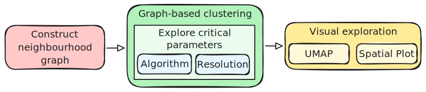

# Graph-Based Clustering

```{r}
#| label: setup
#| include: false

knitr::opts_chunk$set(echo = TRUE, message = FALSE, warning = FALSE)

# set the working directory to the course_files folder
# make sure to run course_files/download_course_files.sh
knitr::opts_knit$set(root.dir = here::here("course_files"))
```

::: {.callout-tip}
#### Learning Objectives

- Explain how graph-based clustering partitions spots based on expression similarity in reduced-dimensional space.
- Construct nearest-neighbour and shared nearest-neighbour graphs.
- Apply graph-based clustering with different algorithms and resolutions to generate alternative clusterings.
- Visualise clustering results on UMAP and tissue coordinates to compare cluster structure and spatial coherence.
- Justify a clustering choice using tissue knowledge and the limitations of expression-only graph-based methods.
:::

## Setup

We continue working with the sagittal mouse brain dataset from previous chapters.

::: {.callout-note collapse="true"}
#### Click to expand

Start by loading the required libraries and the Seurat object.

```{r}
#| label: load-visium-data

# Load libraries
library(Seurat) # single-cell and spatial analysis toolkit
library(sparseMatrixStats)
library(paletteer) # colour palettes
library(ggplot2) # plotting
library(dplyr) # data manipulation
library(patchwork) # combining plots

# Load the Seurat object from the previous chapter
visium <- readRDS("precomputed/mouse_brain_dimred.rds")
```

```{r}
#| label: clean-visium-data
#| include: false

# Remove leftover clusterings from previous chapters
# Need to fix this in the precomputed object to avoid confusion
visium$sctClusters <- NULL
visium$scaledClusters <- NULL
visium[["SCT_nn"]] <- NULL
visium[["SCT_snn"]] <- NULL
visium[["Spatial_nn"]] <- NULL
visium[["Spatial_snn"]] <- NULL
```

As a reminder, this object was created by:

- Importing the raw data using `Load10X_Spatial()`, followed by QC and filtering to remove low-quality spots.
- Data normalisation using `SCTransform()`, which models technical variation and applies variance stabilisation.
  Stored in the "SCT" assay.
- Applying dimensionality reduction using PCA, UMAP and t-SNE.
:::

## Overview

Clustering is a crucial step in spatial transcriptomics analysis, grouping spots/cells on the tissue based on their gene expression profiles to identify distinct cell populations and tissue structures.

Several clustering approaches exist, each with different strengths and limitations.

- **Classical clustering methods** such as k-means and hierarchical clustering become computationally expensive and unreliable in high-dimensional data like single-cell and spatial transcriptomics.
  These methods work on the distances between all pairs of spots/cells, which becomes extremely computationally expensive when dealing with tens of thousands of genes and thousands or millions of spots/cells.
  For these reasons, classical methods are usually not used in spatial transcriptomics analysis and we do not cover them here.

- **Graph-based clustering** offers a more scalable alternative.
  Rather than working on distances between all pairs of spots, graph-based methods first construct a neighbourhood graph based on expression similarity, then partition that graph to find clusters.
  This approach is computationally efficient at scale and performs well on high-dimensional data, making it the popular choice in single-cell and spatial analysis.
  However, this approach treats all spots independently without accounting for their spatial location.

- **Spatially-aware clustering methods** address this limitation.
  These newer approaches explicitly model spatial proximity alongside expression similarity to better respect the tissue structure.

In this section, we focus on graph-based clustering with Seurat, with spatially-aware clustering covered later.
Graph-based clustering includes these main steps:

1. Constructing a nearest-neighbour graph based on expression similarity between the spots in reduced-dimensional space.
2. Partition the graph using graph-based clustering algorithms that identify densely connected regions.
   The resolution of the partition (i.e. how many clusters you find) can be controlled via specific parameters.
3. Visualise the clusters on UMAP and spatial coordinates to assess their quality and spatial coherence.



## Neighbourhood Graph

Neighbourhood graphs are usually built based on the Euclidean distance between each pair of cells on PCA space.
The distance metric can be configured, but Eucilidean is a popular and default choice.

Once the pairwise distances between cells have been calculated, there are two approaches to build the neighbourhood graph:

- **Nearest-neighbour (NN)**: Each cell is connected to its *k* most similar cells.
  For example, if k = 20, a cell will be connected to the 20 cells with the lowest (Euclidean) distance to it.
  While intuitive, this method doesn't take cell density into account.

- **Shared nearest-neighbour (SNN)**: Cells are connected if they share at least *k* neighbours with each other.
  This method is more robust to differences in cell density, as it considers the local neighbourhood structure rather than just pairwise distances.

This neighbourhood graph becomes the basis for the downstream clustering.
The choice of *k* (number of neighbours) and the number of PCA dimensions used can both influence the graph structure and downstream clusters:

- Larger k values produce denser, more connected graphs with fewer, larger clusters.
  Smaller k values give sparser graphs with more granular clustering.
- Using more PCA dimensions includes more subtle variation, whilst using fewer dimensions emphasises dominant patterns.

You can create both of these graphs using the `FindNeighbors()` function.

```{r}
#| label: find-neighbours

# Build a nearest-neighbour graph using the first 50 PCA dimensions
visium <- FindNeighbors(
  visium,
  k.param = 20,
  reduction = "pca",
  dims = 1:50
)

# Check that the graph has been added to the Seurat object
Graphs(visium)
```

Both graphs have been added to the Seurat object under the names "SCT_nn" and "SCT_snn".

## Clustering

Seurat offers the `FindClusters()` function to perform graph-based clustering on the nearest-neighbour graph.
It uses the SNN graph by default, but you can specify the NN graph if you prefer.

```{r}
#| label: find-clusters-default
#| results: "hide"

# Find clusters using the default parameters
visium <- FindClusters(visium)
```

After running the function, Seurat adds a new column to the metadata called `seurat_clusters` containing the cluster assignment for each spot (confirm this with `head(visium[[]])`).
We can use this variable to colour these clusters on a UMAP and spatial plot:

```{r}
#| label: clustering-visualisation-default

# UMAP plot of clusters
umap_clusters <- DimPlot(
  visium,
  reduction = "umap",
  group.by = "seurat_clusters"
) +
  ggtitle("Default clustering") +
  coord_equal() +
  theme_void()

# Spatial plot of clusters
spatial_clusters <- SpatialDimPlot(
  visium,
  group.by = "seurat_clusters"
)

# Assemble the plots side by side
umap_clusters + spatial_clusters & theme(legend.position = "none")
```

We can see that the clusters are reasonably well separated on the UMAP and align quite well with the spatial structure of the tissue.

However, the default parameters may not be optimal for your data and it's important not to blindly rely on them.

::: {.callout-tip collapse="true"}
#### Visualisation tips

You may notice above we've done some customisation of the plots:

- As the coordinates in UMAP plots are arbitrary, we can use `coord_equal()` to ensure that the x and y axes have the same scale and avoid distortions in the visualisation.
- For the same reason, we can use `theme_void()` to remove the axes and background from the UMAP plot, which are not meaningful and can distract from the clusters.
- Finally, we can use `theme(legend.position = "none")` to remove the legend, which is not necessary when the clusters are labelled directly on the plot.
- Instead of setting the theme individually for each plot, we can use the `&` operator from the `patchwork` package to apply it to all plots in the grid at once.
  Learn more about `patchwork` configurations [in their user manual](https://patchwork.data-imaginist.com/).
:::

## Clustering Parameters

There are two key parameters to configure when performing clustering:

- `algorithm`: the graph partitioning algorithm to use.
  Seurat offers four algorithms: (1) **Louvain** (default); (2) **Louvain + multilevel refinement**; (3) **Smart Local Moving (SLM)**; (4) **Leiden**.

- `resolution`: controls the granularity of the clusters.

We will not go into the technical details of how these algorithms work, but in general **Leiden is the recommended starting point**.
This algorithm is an improvement on Louvain that ensures clusters are internally connected.
It can also give more reproducible clusterings compared to Louvain.

Having said that, clustering is itself an artificial partioning of a continuous landscape of gene expression, so there is no single "best" algorithm.
Likewise, there is no universally "correct" resolution.
The choice may depending on whether you expect many distinct populations or a few broad types.

It is often useful to test a few algorithms and resolutions to check that your main conclusions are robust.
We will do this by comparing two algorithms (Louvain and Leiden) at two different resolutions (0.5 and 0.8).

### Algorithm Comparison

Here, we create two clusterings using the default resolution of 0.5: Louvain and Leiden.
We use the `cluster.name` parameter to give each clustering a meaningful name in the metadata, which is useful to keep track of which result came from which run.

```{r}
#| label: clustering
#| warning: false
#| results: "hide"

# Try multiple clustering algorithms and resolutions
visium <- FindClusters(
  visium,
  resolution = 0.5,
  algorithm = 1,
  cluster.name = "Louvain_05"
)
visium <- FindClusters(
  visium,
  resolution = 0.5,
  algorithm = 4,
  cluster.name = "Leiden_05"
)
```

We now have two new columns in the metadata, and can visualise these again on a UMAP and spatial plot to compare the results.

```{r}
#| label: clustering-visualisation-05
#| code-fold: true

# UMAP plot of clusters
umap_louvain05 <- DimPlot(
  visium,
  reduction = "umap",
  group.by = "Louvain_05",
  label = TRUE
) +
  ggtitle("Louvain (res = 0.5)") +
  coord_equal() +
  theme_void()

# Spatial plot of clusters
spatial_louvain05 <- SpatialDimPlot(
  visium,
  group.by = "Louvain_05",
  label = TRUE,
  label.size = 4
)

# UMAP plot of Leiden clusters
umap_leiden05 <- DimPlot(
  visium,
  reduction = "umap",
  group.by = "Leiden_05",
  label = TRUE
) +
  ggtitle("Leiden (res = 0.5)") +
  coord_equal() +
  theme_void()

# Spatial plot of Leiden clusters
spatial_leiden05 <- SpatialDimPlot(
  visium,
  group.by = "Leiden_05",
  label = TRUE,
  label.size = 4
)

# Grid of plots
(umap_louvain05 + spatial_louvain05) /
  (umap_leiden05 + spatial_leiden05) &
  theme(legend.position = "none")
```

In general, both algorithms produce clusters of similar sizes and distributions at this resolution.
They are broadly coherent on the spatial plot, with spots forming spatially-connected clusters.
The Louvain algorithm resulted in more clusters, though some of them are quite small (e.g. 10 and 11).
It is unclear whether they represent biologically meaningful populations or overfitting to technical noise.

It can be hard to distinguish clusters due to the large number of clusters and the colour scheme.
So, it may be worth sometimes **highlighting specific clusters of interest** to see where they are located on the tissue and UMAP.

For example, one notable exception to the spatial coherence is Louvain cluster 5 (Leiden cluster 4), which appears to be split across two spatial regions and on the UMAP.
Let's highlight this cluster on the spatial plot to see where it is located.

```{r}
#| label: highlight-cluster

# Use cells.highlight to highlight specific clusters on the spatial plot
# The WhichCells() function allows us to select cells based on their cluster assignment
SpatialDimPlot(
  visium,
  cells.highlight = WhichCells(visium, expression = Leiden_05 == 4)
) +
  ggtitle("Leiden Cluster 4 Spatial Location")
```

Is this a reasonable clustering result?
As we've emphasised before, **knowledge of your tissue and expected cell types is crucial** to interpret whether these clusters are meaningful or overfitting noise.

### Resolution Comparison

In both cases, at resolution 0.5, both algorithms produce relatively coarse clustering with large clusters.
We can test whether a higher resolution reveals more biologically meaningful structure at a finer scale.
Let's compare this with the resolution of 0.8, which should produce more clusters and reveal finer structure if it exists in the data.

```{r}
#| label: clustering-08
#| results: "hide"
#| code-fold: true

# Find clusters at resolution 0.8
visium <- FindClusters(
  visium,
  resolution = 0.8,
  algorithm = 1,
  cluster.name = "Louvain_08"
)
visium <- FindClusters(
  visium,
  resolution = 0.8,
  algorithm = 4,
  cluster.name = "Leiden_08"
)

# UMAP and spatial plot for Louvain
umap_louvain08 <- DimPlot(
  visium,
  reduction = "umap",
  group.by = "Louvain_08",
  label = TRUE
) +
  ggtitle("Louvain (res = 0.8)") +
  coord_equal() +
  theme_void()

spatial_louvain08 <- SpatialDimPlot(
  visium,
  group.by = "Louvain_08",
  label = TRUE,
  label.size = 4
)

# UMAP and spatial plot for Leiden
umap_leiden08 <- DimPlot(
  visium,
  reduction = "umap",
  group.by = "Leiden_08",
  label = TRUE
) +
  ggtitle("Leiden (res = 0.8)") +
  coord_equal() +
  theme_void()

spatial_leiden08 <- SpatialDimPlot(
  visium,
  group.by = "Leiden_08",
  label = TRUE,
  label.size = 4
)

# Grid of plots
(umap_louvain08 + spatial_louvain08) /
  (umap_leiden08 + spatial_leiden08) &
  theme(legend.position = "none")
```

As expected, increasing the resolution to 0.8 increases the number of clusters.
We went from `r length(unique(visium$Louvain_05))` to `r length(unique(visium$Louvain_08))` for Louvain, and from `r length(unique(visium$Leiden_05))` to `r length(unique(visium$Leiden_08))` for Leiden.

Interestingly, for Louvain this change in resolution only resulted in one more cluster.
But the actual change is more complex than that.
For example:

- The previously highlighted cluster 5 is now split into two clusters (now called 5 and 12).
  This may be a good thing, if those are biologically distinct.
- However, the new clusters 3 and 5 are now less spatially coherent, and in fact contain a mixture of spots of what used to be better spatially-separated clusters at resolution 0.5.

On the other hand, for Leiden, increasing the resolution to 0.8 resulted in three more clusters, but this increase seems to be more spatially coherent with the previous resolution.
For example, old cluster 1 has been split into three clusters (1, 10 and 11), and the old cluster 2 into two (now 2 and 9).

::: {.callout-note collapse="true"}
#### Agreement between clusters using Adjusted Rand Index

In the [Normalisation chapter](02b-Normalisation.qmd), we introduced the Adjusted Rand Index (ARI) as a measure of agreement between two clusterings.
We can use this to quantify how similar the clusterings are across algorithms and resolutions.

```{r}
#| label: ari-comparison

# Create a data frame of pairwise comparisons
ari_comparisons <- data.frame(
  louvain05_vs_leiden05 = mclust::adjustedRandIndex(
    visium$Louvain_05,
    visium$Leiden_05
  ),
  louvain08_vs_leiden08 = mclust::adjustedRandIndex(
    visium$Louvain_08,
    visium$Leiden_08
  ),
  louvain05_vs_louvain08 = mclust::adjustedRandIndex(
    visium$Louvain_05,
    visium$Louvain_08
  ),
  leiden05_vs_leiden08 = mclust::adjustedRandIndex(
    visium$Leiden_05,
    visium$Leiden_08
  )
)

# Print transposed for better readability
t(ari_comparisons)
```

We can see that, in general, the agreement based on this metric is quite high (>0.85 in all cases).
This suggests that the main structure of the clusters is consistent across algorithms and resolutions, even if there are some differences in the finer details as highlighted in our discussion above.
:::

## Which Clustering?

As we've been seeing throughout the course, there is no single "best" answer for this sort of question when it comes to transcriptomic analysis.
The visual exploration we did is informative, but critically you should **use domain knowledge to guide your choices**.
You can ask yourself the following:

- Which result better captures known tissue structure?
- Which produces clusters that are spatially coherent?
- How many clusters do you expect biologically?
- Are you interested in identifying rare subpopulations (higher resolution) or broad cell types (lower resolution)?

Note that clusters in spatial transcriptomics do not always correspond one-to-one with cell types.
A single cell type may be split across multiple clusters if it exists in distinct transcriptional states.
Conversely, a cluster may contain multiple cell types if they share similar gene expression profiles.
You can use marker gene analysis (covered in the next section) to interpret what each cluster represents.

One important limitation of graph-based clustering, which we've already seen, is that it does not make use of spatial information.
All spots are treated independently based only on their expression similarity.
As an alternativel, spatially-aware methods explicitly incorporate spatial proximity to calculate clusterings.
We cover spatially-aware clustering with BANKSY in a [follow-up chapter](08-TissueArchitecture.qmd).

## Exporting the Object

Once you decide on a clustering, you can set those clusters as default cell identities for convenience in downstream analysis:

```{r}
#| label: set-identities

# Set cell identities to the Leiden clustering at resolution 0.8
Idents(visium) <- visium$Leiden_08
```

This allows you, for example, to omit the `group.by` parameter in visualisation functions:

```{r}
#| label: visualise-final-clusters
#| eval: false

SpatialDimPlot(visium, label = TRUE)
```

To be clear, this is done simply for convenience.
It means that if you decide to change the identities later, you don't need to change all the rest of the code.

Also remember, that it's always a good idea to save your intermediate analysis, so you can resume at a later point without having to repeat all the previous steps.

```{r}
#| label: save-object
#| eval: false

# Save the object for future use
saveRDS(visium, "results/mouse_brain_clustering.rds")
```

```{r}
#| label: save-participant-object
#| include: false

saveRDS(visium, "precomputed/mouse_brain_clustering.rds")
```

## Summary

::: {.callout-tip}
#### Key Points

- Graph-based clustering builds a neighbourhood graph from expression similarity and partitions it into clusters.
  - Shared nearest-neighbour (SNN) graphs are the most popular choice and recommended in most workflows.
  - The `FindNeighbors()` function in Seurat builds NN and SNN graphs from selected PCA dimensions.

- Clustering implementations include options for choosing clustering algorithm and resolution.
  - Louvain and Leiden are popular clustering algorithms, with Leiden often recommended for better-connected clusters.
  - The `FindClusters()` in Seurat performs clustering with `algorithm` and `resolution` parameters available to tune these options.

- The resolution parameter controls clustering granularity.
  - Higher resolution generally produces more, finer clusters.
  - Comparing outputs across resolutions helps check whether conclusions are robust.

- UMAP and spatial plots reveal different aspects of cluster quality.
  - UMAP helps assess expression-space separation.
  - Spatial plots help assess whether clusters are spatially coherent in tissue.

- Final clustering choices should be informed by biological expectations, not defaults alone.
  - Use known tissue structure and expected populations to judge whether splits and merges are meaningful.
  - Spatially-aware methods may better preserve tissue structure when spatial context is important.
:::
