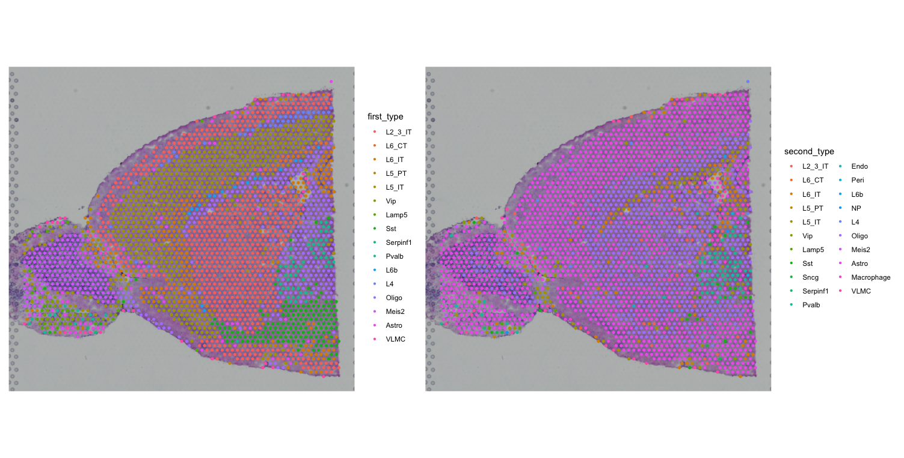
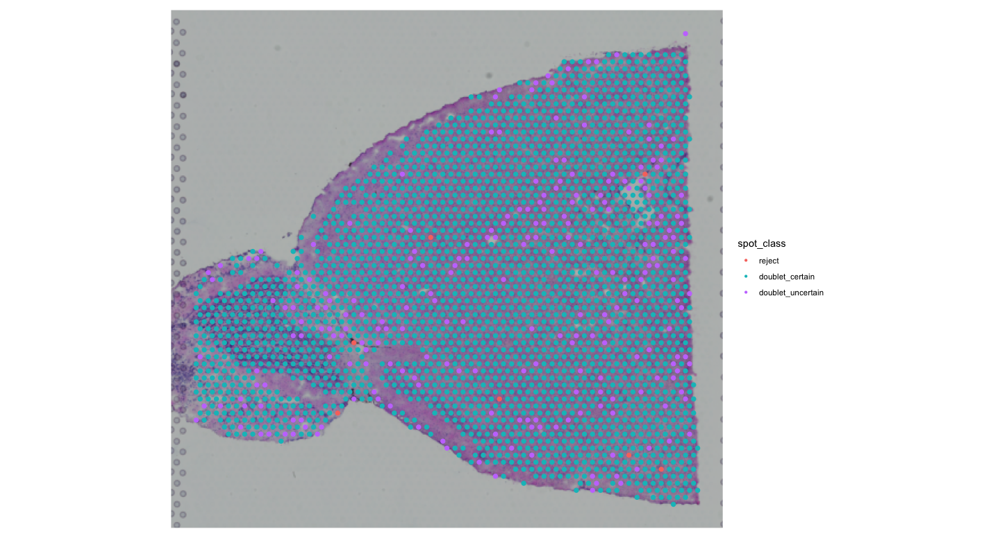
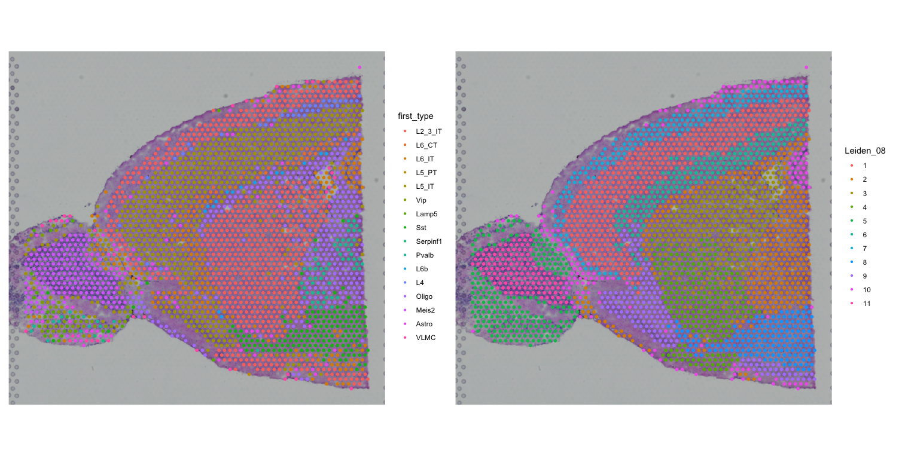
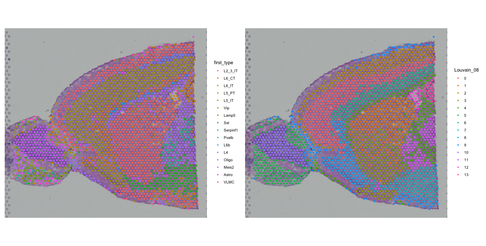

::: {.callout-tip}
#### Learning Objectives

- Understand the concept of deconvolution in spatial transcriptomics
- Apply deconvolution methods to spatial transcriptomics data
- Use the `RCTD` package for deconvolution analysis
- Visualize and interpret deconvolution results
:::

## Deconvolution of Spatial Transcriptomics Data
Deconvolution is a computational technique used to estimate the cellular composition of complex tissues from bulk gene expression data. In the context of spatial transcriptomics, deconvolution can help identify the proportions of different cell types within spatially resolved samples.
We will be using the `RCTD` package, which provides functions for deconvolution of spatial transcriptomics data.

```r
# Load necessary libraries
library(spacexr)
library(pheatmap)
library(SingleCellExperiment)
library(SummarizedExperiment)
library(SpatialExperiment)
```

### Load Data
First, we need to load the the single cell reference data and convert it to an appropriate reference format for RCTD. For this example, we will use a preprocessed single-cell RNA-seq dataset as the reference. We will have a quick look at the data to understand its structure. As this is a precomputed dataset, we will load it from an RDS file and then use the `UpdateSeuratObject` function to ensure compatibility with the latest Seurat version.

```r
ref <- readRDS("precomputed/mouse_brain_reference_for_RCTD.rds")
ref <- UpdateSeuratObject(ref)

DimPlot(ref, reduction = "umap", group.by = "class", label = TRUE) + NoLegend()
DimPlot(ref, reduction = "umap", group.by = "subclass", label = TRUE) + NoLegend()
DimPlot(ref, reduction = "umap", group.by = "cluster", label = TRUE) + NoLegend()
```

::: {.callout-tip collapse="true"}
#### Result
We can use these plots to decide which level of annotation is most appropriate for your deconvolution analysis.

{fig-align="center"}
:::

We will use the subclass annotation for deconvolution, as it provides a good balance between granularity and interpretability. We now need to update the Seurat object to the latest version (just in case it is an older version) and set the identities to the subclass annotation.

```r

Idents(ref) <- "subclass"
```

## Prepare Reference object for RCTD
We will now prepare the reference object for RCTD. This involves extracting the counts, cluster identities, and number of UMIs from the Seurat object and creating a Reference object. If you use a different single-cell dataset, make sure that each celltype has a sufficient number of cells (at least 25) to ensure RCTD will work properly.

```r
counts <- ref[["RNA"]]$counts
cluster <- as.factor(ref$subclass)
names(cluster) <- colnames(ref)
nUMI <- ref$nCount_RNA
names(nUMI) <- colnames(ref)
reference <- Reference(counts, cluster, nUMI)

#We will remove the large objects to save memory
rm(ref, counts, cluster, nUMI)
```

## Prepare Spatial Transcriptomics Data for RCTD
Next, we need to prepare the spatial transcriptomics data for RCTD. We will convert the 'visium' Seurat object to a format compatible with RCTD.

```r
#prepare the spatial data to use with RCTD
counts <- visium[["Spatial"]]$counts
coords <- GetTissueCoordinates(visium)
colnames(coords) <- c("x", "y")
coords[is.na(colnames(coords))] <- NULL
query <- SpatialRNA(coords, counts, colSums(counts))
```

## Run RCTD
Now we can create the RCTD object and run the deconvolution analysis. We will use parallel processing to speed up the computation.

```r
# Create RCTD object on 8 cores
RCTD <- create.RCTD(query, reference, max_cores = 8)
#Clean up memory
rm(query,reference)

#This will run about ~12-15 minutes on 8 cores
RCTD <- run.RCTD(RCTD, doublet_mode = "doublet")
```

This concludes the deconvolution analysis with RCTD. We can now add the results back into the Seurat visium object and visualize them. Because we ran RCTD in doublet mode, we have two sets of results: one for singlets and one for doublets. We will check how many spots are doublets and compare both results.

```r
#Add results back into visium object
visium <- AddMetaData(visium, metadata = RCTD@results$results_df)

#Check how many spots are doublets
SpatialDimPlot(visium, group.by = "spot_class")

#Visualize the results for first and second cell type identified by RCTD
first <- SpatialDimPlot(visium, group.by = "first_type")
second <- SpatialDimPlot(visium, group.by = "second_type")
first + second
```

::: {.callout-tip collapse="true"}
#### Result

{fig-align="center"}

We can see that most spots are classified as doublets. We will in future analyses focus on the first cell type identified by RCTD, but you can also explore the second cell type or both together. 


{fig-align="center"}

These plots show the major cell types identified by RCTD alongside the clusters identified by Seurat. 
:::

We can compare the major cell types identified by RCTD with the clustering we performed earlier using Seurat.

```r
#Compare RCTD results with Seurat clustering
clustered_spatial1 <- SpatialDimPlot(visium, group.by = "Leiden_08", label = FALSE)
first + clustered_spatial1
clustered_spatial2 <- SpatialDimPlot(visium, group.by = "Louvain_08", label = FALSE)
first + clustered_spatial2
```

::: {.callout-tip collapse="true"}
#### Result
We are comparing the major cell types identified by RCTD with the clusters identified by Seurat using two different clustering algorithms (Leiden and Louvain).

{fig-align="center"}

{fig-align="center"}
:::


To finish this, we will do a little more clean-up to free memory.

```r
#Clean up memory
#clean up larger objects
rm(RCTD, counts)
#garbage collection
gc()
```

## Conclusion
In this section, we have learned how to perform deconvolution of spatial transcriptomics data using the `RCTD` package. We prepared both single-cell reference data and spatial transcriptomics data, ran the deconvolution analysis, and visualized the results. Deconvolution can provide valuable insights into the cellular composition of spatially resolved samples, helping to better understand tissue architecture and function.

## Summary  
::: {.callout-tip}
#### Key Points   
- Deconvolution is a computational technique used to estimate the cellular composition of complex tissues from bulk gene expression data.
- The `RCTD` package provides functions for deconvolution of spatial transcriptomics data.
- Preparing both single-cell reference data and spatial transcriptomics data is essential for successful deconvolution analysis.
- Parallel processing can significantly speed up the computation time for deconvolution.
:::

