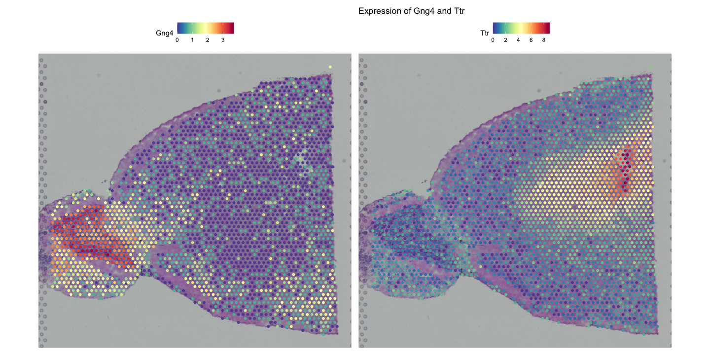
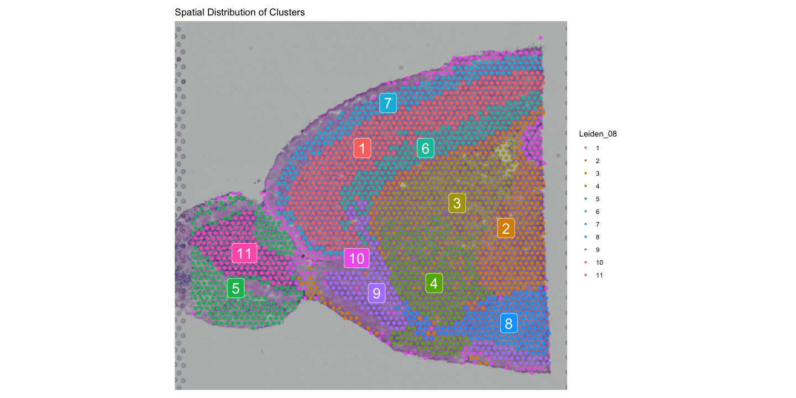
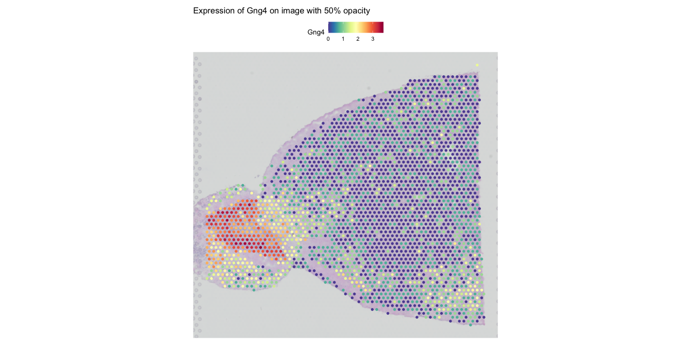
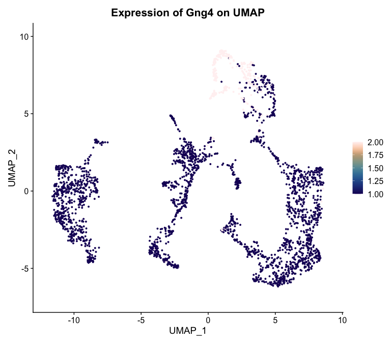
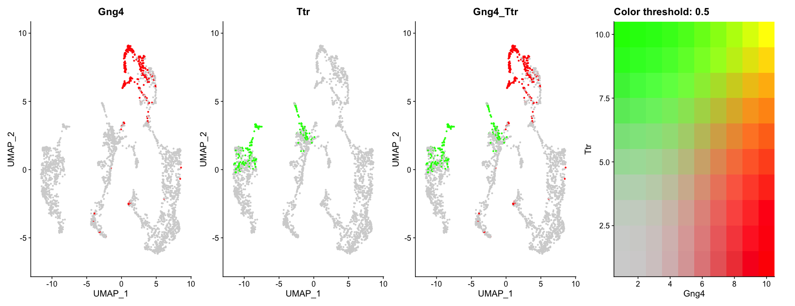
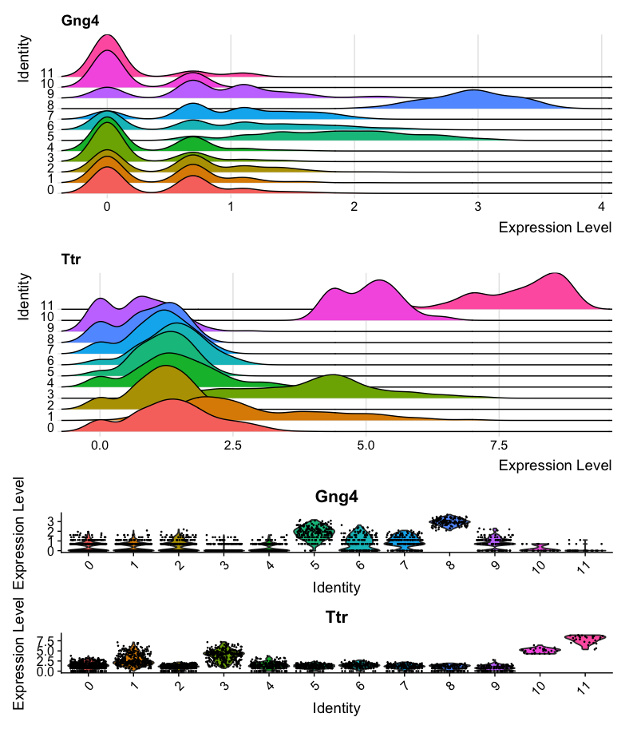
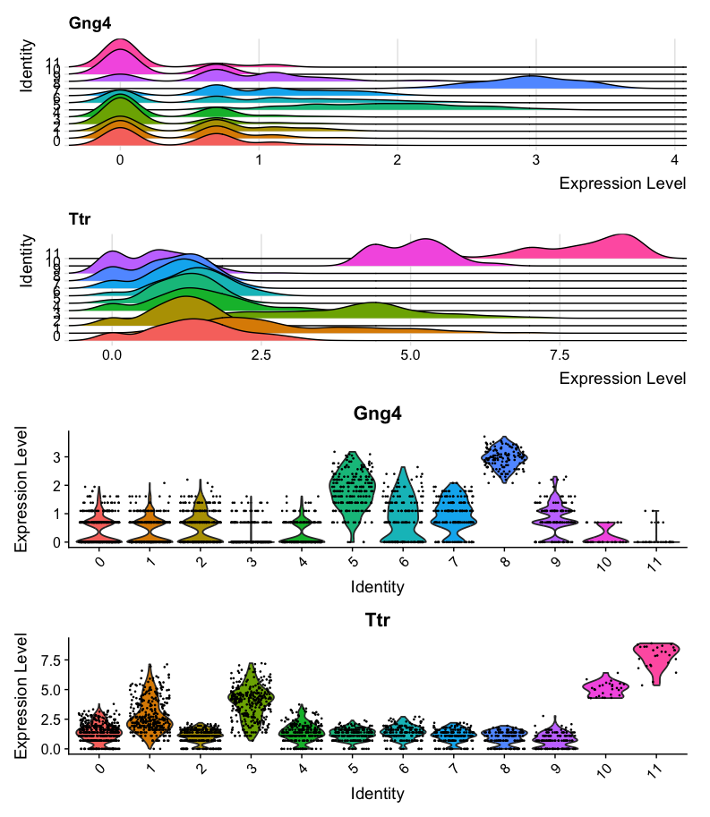
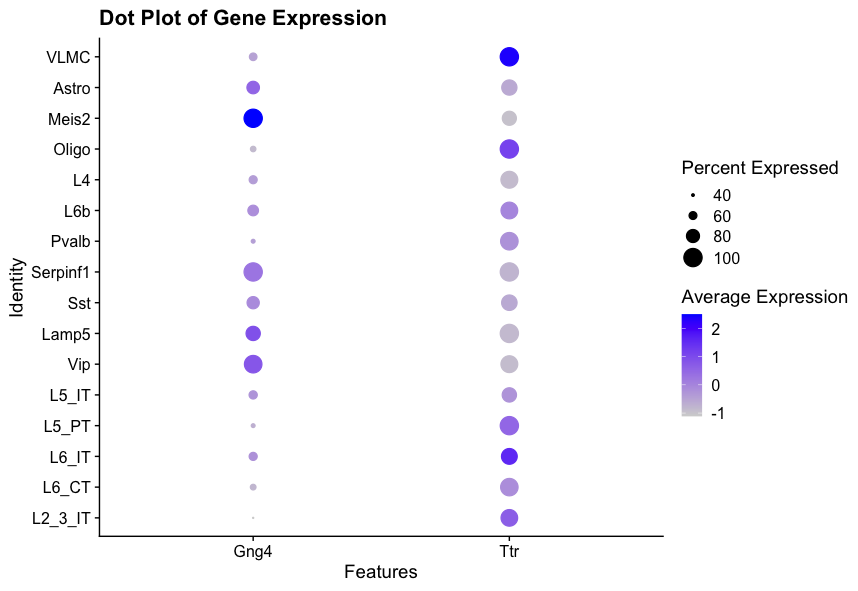
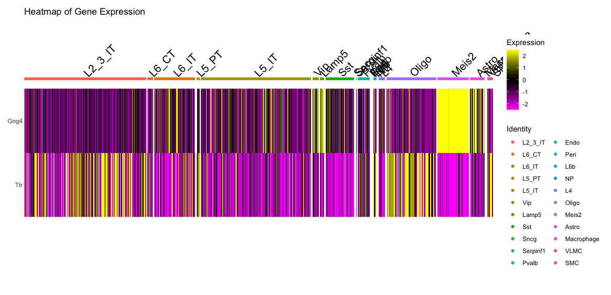

::: {.callout-tip}
#### Learning Objectives

-   Visualize spatial transcriptomics data using Seurat
:::

We have already seen some basic visualizations of spatial transcriptomics data using Seurat in previous chapters. In this chapter, we will explore their parameters and additional visualization techniques to better understand the spatial organization of gene expression in tissues.

## Basic Visualization with Seurat
Seurat provides several functions for visualizing spatial transcriptomics data. The most commonly used function is `SpatialFeaturePlot`, which allows you to visualize the expression of specific genes across the spatial coordinates of the tissue. Another useful function is `SpatialDimPlot`, which can be used to visualize clusters or other metadata across the spatial coordinates.
We have already loaded the library `ggplot2` in previous chapters, which is helpful for customizing plots, for example by adding titles.

```r
# Visualize the expression of specific genes
SpatialFeaturePlot(visium, features = c("Gng4", "Ttr"), ncol  = 2) + ggtitle("Expression of Gng4 and Ttr")
# Visualize clusters across the spatial coordinates
SpatialDimPlot(visium, group.by = "Leiden_08", label = TRUE) + ggtitle("Spatial Distribution of Clusters")
``` 

::: {.callout-tip collapse="true"}
#### Result
The first plot shows the expression of the genes Gng4 and Ttr across the spatial coordinates of the tissue with an added title and using default color scale. 

{fig-align="center"}

Gng4 is involved in G-protein signaling and is often expressed in neuronal tissues especially the olfactory bulb and cortex, while Ttr (transthyretin) is a transport protein primarily found in the liver and choroid plexus of the brain which has been shownto play a role in alzheimer's disease prevention by binding to amyloid-beta peptides.

The second plot shows the spatial distribution of clusters identified by the Leiden algorithm with labels and a title.

{fig-align="center"}
:::

You can customize the appearance of these plots using various parameters, such as changing the color scale, adjusting point size, and modifying titles and labels.
```r
# Customize color scale and point size
SpatialFeaturePlot(visium, features = "Gng4", image.alpha = 0.5) + ggtitle("Expression of Gng4 on image with 50% opacity")
FeaturePlot(visium, features = "Gng4", cols = paletteer::paletteer_d("khroma::lapaz")) + ggtitle("Expression of Gng4 on UMAP")

# Visualize co-expression of two features simultaneously
FeaturePlot(visium, features = c("Gng4", "Ttr"), blend = TRUE)
``` 

::: {.callout-tip collapse="true"}
#### Result
The first plot shows the expression of Gng4 again, but this time overlaid on the tissue image with only 50% opacity, making the histological image less prominent and the gene expression more visible.

{fig-align="center"}

The second plot shows the expression of Gng4 on the UMAP embedding using a custom color palette from the `khroma` package.

{fig-align="center"}

The last plot shows the co-expression of Gng4 and Ttr on the UMAP projection simultaneously using a blended color scheme, allowing us to see areas where both genes are expressed versus areas where only one gene is expressed. Unfortunately it is not possible to do this on spatial coordinates in Seurat at the moment.

{fig-align="center"}
:::

## Interactive Visualization with Seurat
Interactive visualization in Seurat can be used to subset a dataset based on spatial location. This can helb to select specific regions of interest within the tissue for further analysis. It saves the selected cells into the given variable, which can then be used to subset the Seurat object.

```r
# Interactive selection of spots in the spatial plot
selected_cells <- InteractiveSpatialPlot(visium)
```

::: {.callout-tip collapse="true"}
#### Result
The `InteractiveSpatialPlot` function opens an interactive window where you can select spots directly on the spatial plot using your mouse. After making your selection, the selected cell barcodes are saved into the `selected_cells` variable for further analysis. Additionally you can zoom in anout of the plot manually or by selecting clusters that you want to focus on.
:::

## Additional Visualization Techniques
Beyond the basic visualization functions provided by Seurat, there are several additional packages that can enhance your ability to visualize and interpret spatial transcriptomics data. Some of these packages include `ggplot2`, `cowplot`, and `patchwork` for advanced plotting capabilities. We have already loaded `ggplot2` in previous chapters, so we will use it here along with `patchwork` to create more complex visualizations. `cowplot` is another option for combining multiple plots into a single figure, but we will focus on `patchwork` here.

```r
# Example of using ggplot2 and patchwork for custom visualizations
library(patchwork)  
# Create a ridge plot of gene expression across spatial coordinates
ridge_plot <- RidgePlot(visium, features = c("Gng4", "Ttr"), ncol = 1, group.by = 'seurat_clusters')
# Create a violin plot of gene expression across clusters
violin_plot <- VlnPlot(visium, features = c("Gng4", "Ttr"), ncol = 1, group.by = 'seurat_clusters')
# Combine plots using patchwork
ridge_plot + violin_plot
#Combine plots with different heights
ridge_plot + violin_plot + plot_layout(heights = c(1,1,3))
```
::: {.callout-tip collapse="true"}
#### Result
The first plot shows a ridge plot of the expression of Gng4 and Ttr across different clusters identified by Seurat. Below it, a violin plot shows the distribution of expression levels for the same genes across the clusters. The two plots are combined using the `patchwork` package for better visualization. However, the violing plot is not very easy to read in this format, as it is quite compressed.

{fig-align="center"}

The second combined plot shows the same ridge and violin plots, but with adjusted heights to make the violin plot more readable.

{fig-align="center"}
:::

```r
# Create a dot plot of gene expression across celltypes
DotPlot(visium, features = c("Gng4", "Ttr"), group.by = 'first_type') + ggtitle("Dot Plot of Gene Expression")
# Create a heatmap of gene expression across celltypes
DoHeatmap(visium, features = c("Gng4", "Ttr"), group.by = 'first_type') + ggtitle("Heatmap of Gene Expression")  
```

::: {.callout-tip collapse="true"}
#### Result
The first plot shows a dot plot of the expression of Gng4 and Ttr across different cell types identified by RCTD. The size of the dots represents the percentage of cells expressing the gene, while the saturation represents the average expression level.
{fig-align="center"}

The second plot shows a heatmap of the expression of Gng4 and Ttr across different cell types identified by RCTD. The color scale represents the gene expression level of the genes in each cell , the cell types are grouped together for better visualization.
{fig-align="center"}
:::

## Conclusion
In this section, we have explored various visualization techniques for spatial transcriptomics data using Seurat and other R packages. Effective visualization is crucial for interpreting complex spatial data and gaining insights into tissue architecture and function. By leveraging these tools, you can create informative and visually appealing representations of your spatial transcriptomics data.

## Summary  
::: {.callout-tip}
#### Key Points   
- Seurat provides functions like `SpatialFeaturePlot` and `SpatialDimPlot` for visualizing spatial transcriptomics data.
- Customization options allow for enhanced visualization of gene expression and clusters.
- Additional R packages like `ggplot2` and `patchwork` can be used for advanced plotting techniques.
::: 