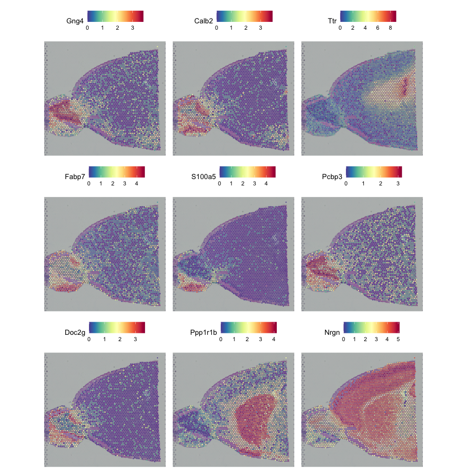
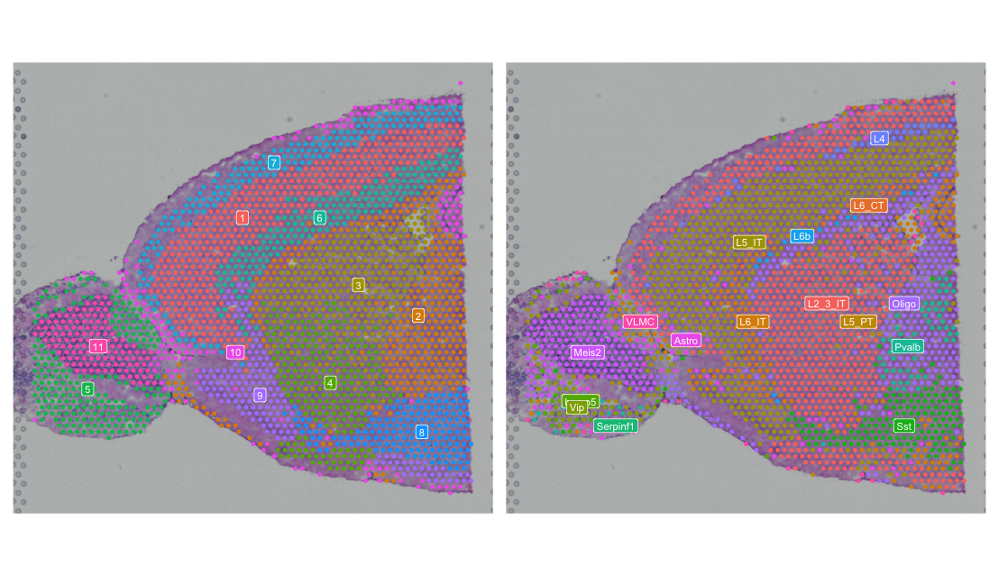

::: {.callout-tip}
#### Learning Objectives

-  Identify spatially variable features in spatial transcriptomics data
-  Visualize spatially variable features on spatial maps
-  Understand the biological significance of spatially variable features
:::

## Identifying Spatially Variable Features
Spatially variable features are genes or transcripts that show significant variation in expression across different spatial locations within a tissue sample. Identifying these features can provide insights into the spatial organization of gene expression and the underlying biological processes.
In Seurat, you can use the `FindSpatiallyVariableFeatures` function to identify spatially variable features in your spatial transcriptomics data. This function performs statistical tests to identify genes that exhibit significant spatial variability.

```r  
# Identify spatially variable features using the "moransi" method
visium <- FindSpatiallyVariableFeatures(visium, assay = "SCT", selection.method = "moransi", nfeatures = 100)
# View the top spatially variable features
head(SpatiallyVariableFeatures(visium), 10)
```
Seurat offers several methods for identifying spatially variable features, including "markvariogram" and  "moransi". The choice of method may depend on the specific characteristics of your data and the biological questions you are interested in. In this example, we used the "moransi" method, which is based on Moran's I statistic.
We will limit our analysis to the top 100 spatially variable features, but you can adjust this number based on your dataset and research goals. We are also not running this analysis using the markvariogram method, as it takes a long time to compute.

If you would like to compare the results of both methods, you will have to run the markvariogram method on a copy of the Seurat object, as running `FindSpatiallyVariableFeatures` again will overwrite the previous results.
## Visualizing Spatially Variable Features
Once you have identified spatially variable features, you can visualize them on spatial maps using the `SpatialFeaturePlot` function. We will also add the SpatialDimPlot to the visualization to see how the spatially variable features relate to the clusters we have previously identified.

```r
# Visualize the top nine spatially variable features on a spatial plot with clusters and celltype annotations for comparison
top9_spatial_features <- head(SpatiallyVariableFeatures(visium), 9)
SpatialFeaturePlot(visium, features = top9_spatial_features, ncol = 3) 

clustering <- SpatialDimPlot(visium, group.by = "Leiden_08", label = TRUE, label.size = 3) + NoLegend()
celltyping <- SpatialDimPlot(visium, group.by = "first_type", label = TRUE, label.size = 3) + NoLegend()

clustering + celltyping
```

::: {.callout-tip collapse="true"}
#### Result
The first plot shows the spatial expression patterns of the top nine spatially variable features identified using the "moransi" method.

{fig-align="center"}

For comparison, the second plot shows the spatial distribution of clusters identified by the Leiden algorithm and the spatial distribution of cell type annotations.

{fig-align="center"}
:::

We can see that some - but not all - of the spatially variable features show spatial patterns matching our previously computed clusters and majority celltypes identified through deconvolution.  While those clusters are not spatially aware, they still capture some of the spatial variation in the data, potentially because some cell types are spatially organized. We will later have a chance to compute spatially aware clusters and compare the results of those clusters and their marker genes to the spatially variable features we have identified here.

## Biological Significance of Spatially Variable Features
Spatially variable features can provide insights into the biological processes and cellular interactions occurring within a tissue. For example, genes that are spatially variable may be involved in cell-cell communication, tissue organization, or responses to environmental cues. By studying these features, researchers can gain a better understanding of the spatial organization of gene expression and its implications for tissue function and disease.
To further explore the biological significance of the identified spatially variable features, you can perform downstream analyses such as pathway enrichment analysis or gene ontology analysis. These analyses can help to identify biological pathways and processes that are enriched among the spatially variable features, providing insights into their functional roles within the tissue.

## Conclusion
In this chapter, we have learned how to identify spatially variable features in spatial transcriptomics data using Seurat. We have also visualized these features on spatial maps and discussed their potential biological significance. Identifying spatially variable features is an important step in understanding the spatial organization of gene expression and the underlying biological processes within tissues.

## Summary
::: {.callout-tip}
#### Key Points
- Spatially variable features are genes or transcripts that show significant variation in expression across different spatial locations within a tissue sample.
- The `FindSpatiallyVariableFeatures` function in Seurat can be used to identify spatially variable features using various statistical methods.
- Visualizing spatially variable features on spatial maps can help to identify spatial patterns and relationships with other features such as clusters.
- Spatially variable features can provide insights into the biological processes and cellular interactions occurring within a tissue.
:::

