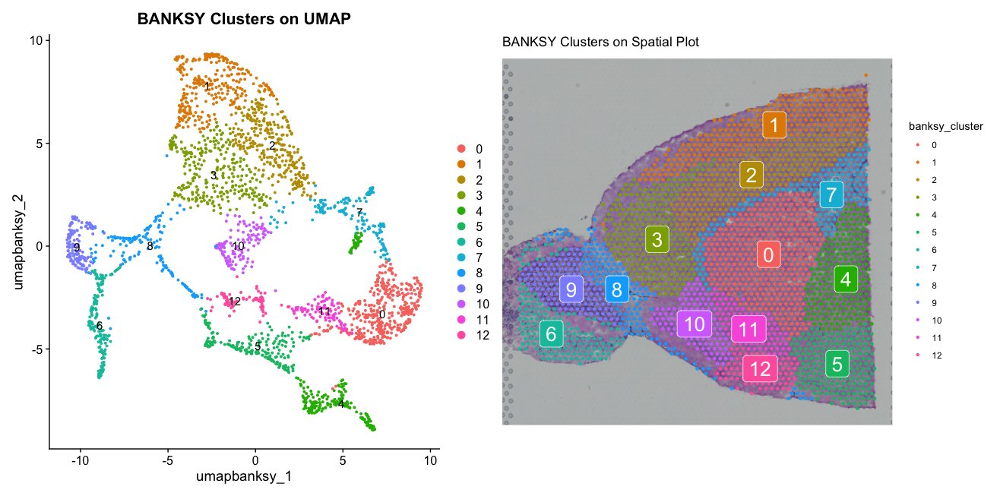
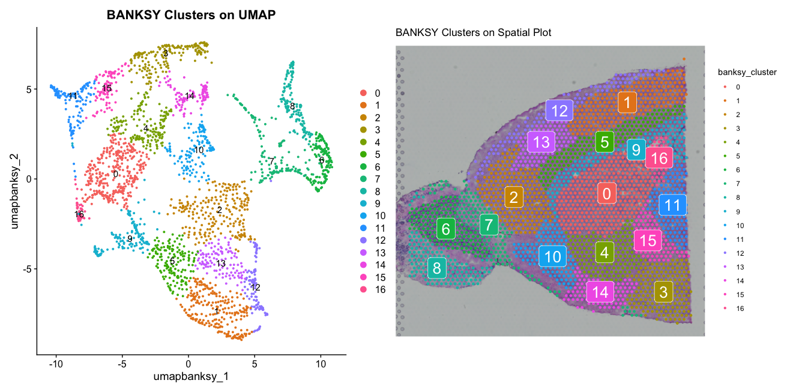
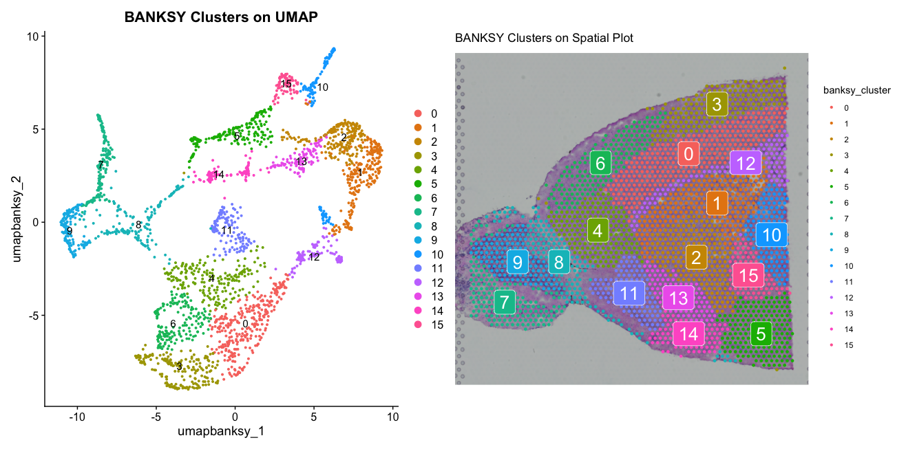
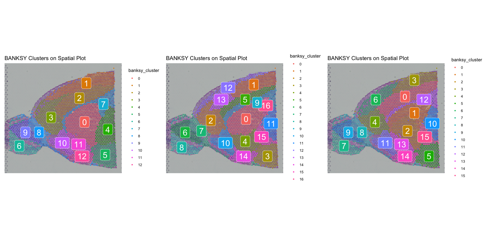
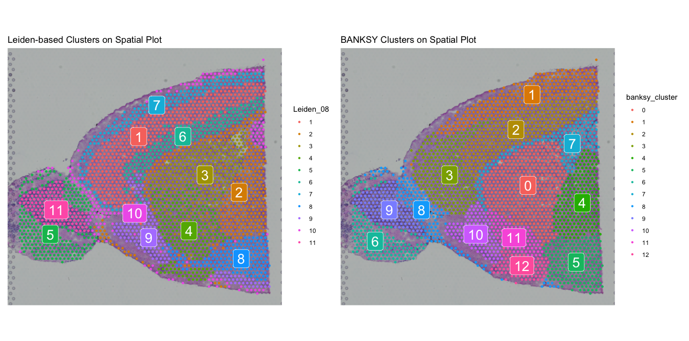

::: {.callout-tip}
#### Learning Objectives

- Identify and characterize tissue architecture using BANKSY
- Compare tissue architecture to cell type distributions and non-spatially informed clustering
- Analyse correlations between tissue architecture and spatially variable genes
:::

## Introduction to Tissue Architecture Analysis
Tissue architecture refers to the spatial organization and arrangement of cells within a tissue. Understanding tissue architecture is crucial for elucidating the functional roles of different cell types and their interactions within the tissue microenvironment. In spatial transcriptomics, analyzing tissue architecture can provide insights into how cellular organization influences gene expression patterns and tissue function.
In this chapter, we will explore how to identify and characterize tissue architecture using the `BANKSY` package. We will also compare tissue architecture to cell type distributions and non-spatially informed clustering, and analyze correlations between tissue architecture and spatially variable genes.

```r
# Load necessary libraries
library(SeuratWrappers)
library(Banksy)
```

To run BANKSY, we wourld need to convert our Seurat object to a `BANKSY` object.  However we are loading the package 'SeuratWrappers' instead, which contains the function `RunBanksy` that allows us to run BANKSY directly on a Seurat object. We will still save the results in a separate Seurat object to keep the original object unchanged, as you cannot re-run BANKSY on the same object without issues in case you want to try different parameters.

```r
# Run BANKSY on the Seurat object
banksy <- RunBanksy(visium, assay = "SCT", lambda = 0.4, verbose = TRUE,
                    features = "variable", k_geom = 50)
```

After running BANKSY, we have to re-run PCA and UMAP on the new BANKSY reduction to visualize the results. We will also re-cluster the data based on the BANKSY reduction to identify tissue architecture clusters. However, we should not re-scale the data, as this would overwrite the normalisation BANKSY has already performed.
The native BANKSY package uses Leiden clustering, so we will also use Leiden clusters for the tissue architecture clusters by keeping the method as default. 

```r
banksy <- RunPCA(banksy, assay = "BANKSY", reduction.name = "pca.banksy", features = rownames(banksy), npcs = 30)
banksy <- FindNeighbors(banksy, reduction = "pca.banksy", dims = 1:30)
banksy <- FindClusters(banksy, cluster.name = "banksy_cluster", resolution = 0.5)
```

We can visualize the BANKSY clusters on a UMAP plot and a spatial plot to see how they relate to the spatial organization of the tissue.

```r
banksy <- RunUMAP(banksy, reduction = "pca.banksy", dims = 1:30, reduction.name = "umap.banksy")
bdp <- DimPlot(banksy, reduction = "umap.banksy", group.by = "banksy_cluster", label = TRUE) + ggtitle("BANKSY Clusters on UMAP")
bsp <- SpatialDimPlot(banksy, group.by = "banksy_cluster", label = TRUE) + ggtitle("BANKSY Clusters on Spatial Plot")
bdp + bsp
```

::: {.callout-tip collapse="true"}
#### Result
The plots show the BANKSY clusters on both UMAP and spatial plots. 
The UMAP differs from the previous UMAPs we have seen, as it is based on the BANKSY reduction which incorporates spatial information.
The spatial plot reveals how the BANKSY clusters correspond to distinct regions within the tissue, highlighting the tissue architecture captured by BANKSY.


:::

We will now compare this result to ones changing the parameter `lambda`, which controls the balance between spatial and transcriptional information. A higher `lambda` value gives more weight to spatial information, while a lower value gives more weight to transcriptional information. We will run BANKSY again with a higher `lambda` value of 0.8 and compare the results.

```r
banksy2 <- RunBanksy(visium, assay = "SCT", lambda = 0.8, verbose = TRUE,
                    features = "variable", k_geom = 15)

banksy2 <- RunPCA(banksy2, assay = "BANKSY", reduction.name = "pca.banksy", features = rownames(banksy), npcs = 30)
banksy2 <- FindNeighbors(banksy2, reduction = "pca.banksy", dims = 1:30)
banksy2 <- FindClusters(banksy2, cluster.name = "banksy_cluster", resolution = 0.8)
banksy2 <- RunUMAP(banksy2, reduction = "pca.banksy", dims = 1:30, reduction.name = "umap.banksy")

bdp2 <- DimPlot(banksy2, reduction = "umap.banksy", group.by = "banksy_cluster", label = TRUE) + ggtitle("BANKSY Clusters on UMAP")
bsp2 <- SpatialDimPlot(banksy2, group.by = "banksy_cluster", label = TRUE) + ggtitle("BANKSY Clusters on Spatial Plot")
bdp2 + bsp2
```

::: {.callout-tip collapse="true"}
#### Result
The plots show the BANKSY clusters with `lambda` set to 0.8 (instead of the original 0.4) on both UMAP and spatial plots. This time the BANKSY clusters appear more spatially coherent, reflecting the increased emphasis on spatial information in the clustering process.


:::

The second parameter we should consider changing is `k_geom`, which controls the number of nearest neighbors used to construct the spatial graph. A higher value of `k_geom` will result in a more connected graph, while a lower value will result in a more fragmented graph. We will run BANKSY again with a lower `k_geom` value of 30 and compare the results.

```r
banksy3 <- RunBanksy(visium, assay = "SCT", lambda = 0.4, verbose = TRUE,
                     features = "variable", k_geom = 30)

banksy3 <- RunPCA(banksy3, assay = "BANKSY", reduction.name = "pca.banksy", features = rownames(banksy), npcs = 30)
banksy3 <- FindNeighbors(banksy3, reduction = "pca.banksy", dims = 1:30)
banksy3 <- FindClusters(banksy3, cluster.name = "banksy_cluster", resolution = 0.8)
banksy3 <- RunUMAP(banksy3, reduction = "pca.banksy", dims = 1:30, reduction.name = "umap.banksy")

bdp3 <- DimPlot(banksy3, reduction = "umap.banksy", group.by = "banksy_cluster", label = TRUE) + ggtitle("BANKSY Clusters on UMAP")
bsp3 <- SpatialDimPlot(banksy3, group.by = "banksy_cluster", label = TRUE) + ggtitle("BANKSY Clusters on Spatial Plot")
bdp3 + bsp3
```

::: {.callout-tip collapse="true"}
#### Result
The plots show the BANKSY clusters with k_geom set to 30 (instead of the original 50) on both UMAP and spatial plots. We can see that the result with a lower `k_geom` value of 15 shows more fragmented clusters, while the result with a higher `k_geom` value of 50 shows more connected clusters. Again, depending on the biological question, one may be more relevant than the other.


:::

We can now compare all three results side by side to see the differences in tissue architecture captured by BANKSY with different parameters.

```r
bsp + bsp2 + bsp3
```

::: {.callout-tip collapse="true"}
#### Result
The spatial plots show the BANKSY clusters with different parameter settings side by side. We can see that the choice of parameters can significantly impact the identified tissue architecture. The first plot (`lambda` = 0.4, `k_geom `= 50) shows a balance between spatial coherence and transcriptional diversity, while the second plot (`lambda` = 0.8, `k_geom` = 15) emphasizes spatial coherence more strongly. The third plot (`lambda` = 0.4, `k_geom` = 30) shows a more fragmented tissue architecture due to the lower `k_geom` value.


:::

 We will keep using lambda = 0.4 and k_geom = 50 for the rest of the analysis and clean up the other trys.

```r
rm(banksy2, banksy3, bdp2, bdp3, bsp2, bsp3)
gc()
```

## Comparing Tissue Architecture to Non-spatially Informed Clustering and Spatially Variable Genes
We can compare the BANKSY clusters to the vlusters we have previously identified using non-spatially informed clusteringand the spatially variable genes. We can visualize the previous clusters on a spatial plot and compare them to the BANKSY clusters.

```r
p1 <- SpatialDimPlot(visium, group.by = "Leiden_08", label = TRUE) + ggtitle("Leiden-based Clusters on Spatial Plot")
p2 <- SpatialDimPlot(banksy, group.by = "banksy_cluster", label = TRUE) + ggtitle("BANKSY Clusters on Spatial Plot")
p1 + p2
```

::: {.callout-tip collapse="true"}
#### Result
The spatial plots show the non-spatially informed Leiden clusters (left) and the BANKSY clusters (right) side by side.



We can see that the BANKSY clusters are more spatially coherent than the Seurat clusters, which are based solely on transcriptional information. This suggests that BANKSY is able to capture the spatial organization of the tissue better than non-spatially informed clustering.
:::

Additionally we can find markers for the BANKSY clusters and compare them to the spatially variable genes we have previously identified. 

```r
# Find markers for BANKSY clusters
banksy_markers <- FindAllMarkers(banksy, only.pos = TRUE, min.pct = 0.25, logfc.threshold = 0.25, pvalue.cutoff = 0.05)
# Overlap with spatially variable genes
spatially_variable_genes <- SpatiallyVariableFeatures(visium)
banksy_marker_genes <- unique(banksy_markers$gene)
overlap_genes <- intersect(spatially_variable_genes, banksy_marker_genes)
spatially_only <- setdiff(spatially_variable_genes, banksy_marker_genes)
banksy_only <- setdiff(banksy_marker_genes, spatially_variable_genes)
length(spatially_only)
length(overlap_genes)
```

Looking at the lengths of the different gene sets, we can see that all spatially variable genes are also BANKSY markers, but BANKSY has identified additional marker genes that are not spatially variable. This shows that BANKSY is able to capture both spatial and transcriptional information, while the spatially variable genes only capture spatial information.

We can also compare the BANKSY marker genes to the ones from the non-spatially informed Leiden clusters we have previously identified. 

```r
cluster_marker_genes <- unique(markers$gene)
overlap_genes2 <- intersect(banksy_marker_genes, cluster_marker_genes)
banksy_only2 <- setdiff(banksy_marker_genes, cluster_marker_genes)
cluster_only <- setdiff(cluster_marker_genes, banksy_marker_genes)
length(banksy_only2)
length(overlap_genes2)
length(cluster_only)
```

In this case we see that there are a lot of differences between the BANKSY markers and the non-spatially informed cluster markers. This suggests that BANKSY is able to capture different aspects of the data than non-spatially informed clustering, likely due to its ability to incorporate spatial information. At the same time, non-spatially informed clustering also can identify clusters of celltypes that are not spatially organized or sparsely distributed (for example invading immune cells in a tumour), which BANKSY might miss due to its focus on spatial coherence.

## Conclusion

BANKSY is a powerful tool for analyzing tissue architecture in spatial transcriptomics data. By incorporating both spatial and transcriptional information, BANKSY is able to identify spatially coherent clusters that reflect the underlying tissue organization. Non-spatially informed clustering can still be useful for identifying cell types that are not spatially organized, so it can be important to consider both approaches dependent on the biological question.

## Summary
::: {.callout-tip}
#### Key Points
- Tissue architecture refers to the spatial organization and arrangement of cells within a tissue.
- The `BANKSY` package can be used to identify and characterize tissue architecture by incorporating both spatial and transcriptional information.
- BANKSY clusters are often more spatially coherent than non-spatially informed clusters.
- BANKSY can identify marker genes that overlap with spatially variable genes, but also identifies additional markers.
- Non-spatially informed clustering can still be useful for identifying cell types that are not spatially organized.
:::
